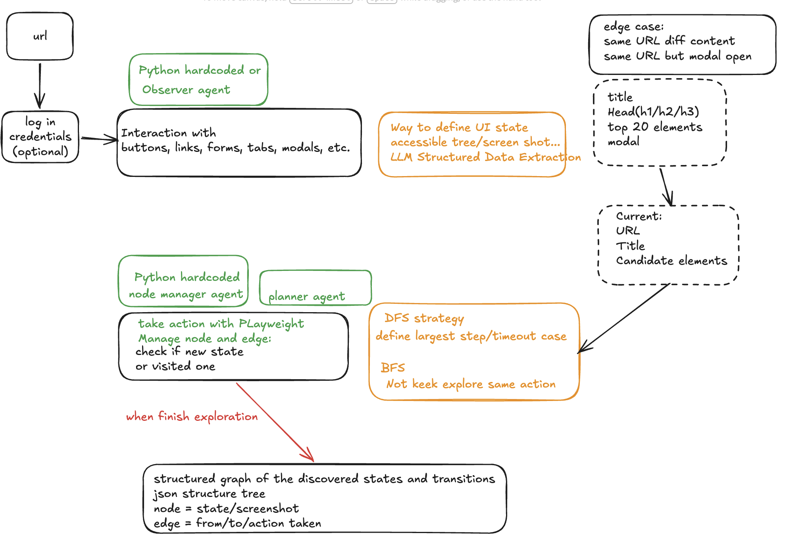

# Web Agent

## Project Overview

This is a prototype for a web interaction and state exploration agent. The goal is to crawl a web page (or app) with automatic actions and capture UI states, building a graph of discovered states/transitions with screenshots + structured data.

Key output is in `agent_output/`.

## Files

- `main.py`: primary entry point for the agent logic
- `Design Document.md`: architectural notes and design decisions
- `prototype_run_notes.md`: test notes and observations
- `requirements.txt`: Python dependencies
- `.env`: environment settings
- `agent_output/`: structured graph output and screenshots
- `workflow.png`: visual workflow illustration

## Setup

1. Create Python virtual environment: `python -m venv .venv`
2. Activate: `source .venv/bin/activate`
3. Install dependencies: `pip install -r requirements.txt`
4. Add any env variables to `.env` if needed

## Run

`python main.py`

Adjust parameters in `main.py` as needed for target URL, credentials, timeouts, etc.

## Workflow Illustration (path as "illusion")

The process is:

1. Start from URL and optional login credentials
2. Agent captures current UI state (URL, title, DOM summary) - candidate elements (buttons, links, forms, tabs, modals)
3. Node manager handles states/nodes and transitions/edges
4. Exploration strategy (BFS/DFS) chooses next action
5. Execute action via Playwright (click, fill, submit, navigate)
6. Capture new state (graph node), detect duplicates via URL+content
7. Continue until all reachable states or timeout
8. Output graph JSON in `agent_output/graph.json`, with nodes and edges

### Edge cases handled

- Same URL but different content (modal open, different content snapshot)
- Same URL and same content (dedupe as existing state)

## Visual & Tooling

For the full visual workflow, open `workflow.png` in the repo root. It shows the same flow with steps and decision points.

---

For your request, this README is now the project landing doc and includes your workflow path as an illustrated description. Feel free to update wording to match your exact intent.